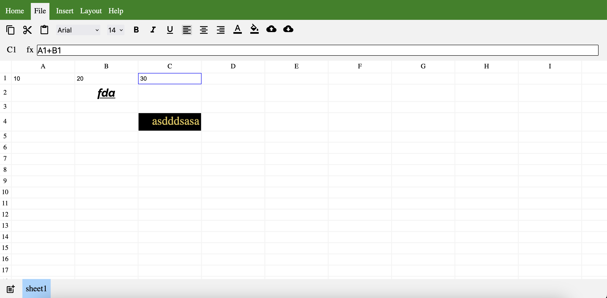

#Mimicking Google Sheets

> A spreadsheet editing app build using Reactjs.

## Screenshot:

<b>[Experience it Live](https://main--comforting-biscotti-e87a56.netlify.app)</b>

Features
1. Spreadsheet Interface
UI Mimicry: The interface is designed to resemble Google Sheets, including elements like a toolbar, formula bar, and cell structure.
Drag Functionality: Users can drag cells, formulas, and selections across the sheet, similar to Google Sheets.
Cell Dependencies: Formulas and functions respect cell dependencies and automatically update when related cells change.
Cell Formatting: Basic formatting options are available, including bold, italics, font size, and color changes for selected cells.
Row and Column Management: Users can add, delete, and resize rows and columns as required.
2. Mathematical Functions
The following mathematical functions are implemented:

SUM: Calculates the sum of a range of cells.
AVERAGE: Computes the average of a range of cells.
MAX: Finds the maximum value in a range of cells.
MIN: Finds the minimum value in a range of cells.
COUNT: Counts the number of cells containing numerical values in a range.
3. Data Quality Functions
The following data quality functions are available:

TRIM: Removes leading and trailing whitespace from a cell.
UPPER: Converts the text in a cell to uppercase.
LOWER: Converts the text in a cell to lowercase.
REMOVE_DUPLICATES: Removes duplicate rows from a selected range.
FIND_AND_REPLACE: Allows users to find and replace specific text within a selected range.
4. Data Entry and Validation
Data Types: The app supports entering various types of data including numbers, text, and dates.
Data Validation: Basic data validation is in place, such as ensuring numeric cells only accept numeric values.
5. Testing
Users can test mathematical and data quality functions with their own data.
Function execution results are displayed clearly for easy verification and debugging.

1. Editing cells.
2. Applying styles to cells.
   1. Bold.
   2. Italic.
   3. Underline.
   4. Alignment (left, center, right)
   5. Font Family.
   6. Font Size.
   7. Color.
   8. Background Color.
